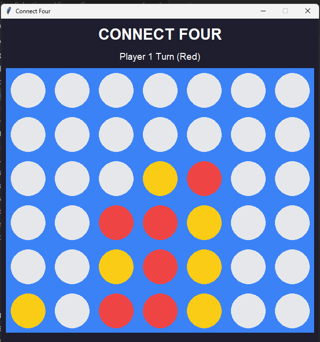

# Connect Four Game

A modern and interactive Connect Four game built using Python and Tkinter.

## Preview

---

## Features

- Clean graphical user interface
- Two-player gameplay
- Automatic win detection
- Draw detection
- Restart game button
- Structured beginner-friendly code
- Lightweight and fast

---

## Technologies Used

- Python
- Tkinter

